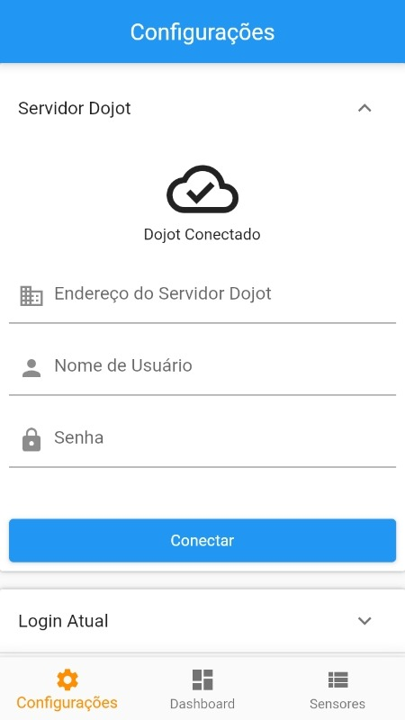

# Iot Aquicultura Mobile

Aplicativo para monitoramento de sistema IoT (Internet of Things) voltado à aquicultrua 4.0. Ele pretende facilitar o monitoramento dos diversos nós e sensores do sistema, por meio da apresentação de dashboards customizados na interface do app. O aplicativo também emitirá notificações de emergencia, indicando problemas nos nós do sistema.

App desenvolvido como projeto da Disciplina Fundamentos de Informática Aplicada da UFRPE/PPGIA.
Testado, até então, somente em dispositivo Android!

## Logo

## Framework
Aplicativo desenvolvido com a tecnologia Flutter (https://flutter.dev)

## Pacotes Utilizadas:

|Nome|Versão|Proposito|
|--|--|--|
|syncfusion_flutter_charts|^19.2.47+1|Renderizar gráficos em tempo real|
|syncfusion_flutter_gauges|^19.2.47|Renderizar Sliders em tempo real|
|http|^0.13.3|Integração com REST APIs|
|flutter_launcher_icons|^0.8.0|Simplificar a geração de ícones durante o build do app|

## [Widget Tree](./docs/widget_tree.pdf)

## [Diagrama de Navegação de Telas](./docs/diagrama_navegacao_telas.png)

## Telas do Aplicativo

